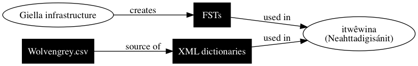

Overview
========

Welcome to [itwêwina]---a smart [Plains Cree] dictionary.

itwêwina uses [finite-state transducers][FST] (FSTs) to analyze
the structure of Cree words, as well as to conjugate Cree words.

There are many projects that tie into this effort: notably,

 - **[Giella](#giella)**---an infrastructure for the FSTs; and
 - **[Neahttadigisanít](#neahttadigisanít)**—the web application that powers itwêwina.

We use the Giella infrastructure to compile the FSTs (to a data
structure), which we then link to from the Neahttadigisanít web
application.

Giella
------

**Giella** is an infrastructure for creating language technology,
including _morphological analyzers_ like the Plains Cree FSTs. Giella
was created by the [Giellatekno research group][giellatekno] at the
University of Tromsø.

Neahttadigisanít
----------------

itwêwina
--------

**itwêwina** is a fork of [Neahttadigisanít]. It combines the FSTs
created in Giella with the XML dictionaries to provide an FST-powered,
smart, online dictionary. As of this writing, only one dictionary source
is integrated—Dr. Arok Wolvengrey's [Cree: Words]—however, more are to
come.

### Cloning the repository

itwêwina can be cloned from here: <https://github.com/UAlbertaALTLab/itwewina>.

Included in this repository is the source code for Neahttadigisanít (in
a directory called `neahtta/`), along with the documentation you are
reading right now. **Not included** in this repository are the FSTs or
the XML dictionaries. Since the licenses and copying rights of the
dictionaries are a bit iffy, you'll need to ask somebody for access to
the dictionaries. The FSTs are be compiled using [Giella]. See [Getting
Started with Giella][getting-started].

Minor projects
--------------

### [crk_orthography]

A bidirectional [SRO]/[syllabics] transliterator for Plains Cree.
[Try it here](https://crk-orthography-demo.herokuapp.com/)!

You can also `pip install` it:

    pip install crk-orthography

As of this writing, [crk_orthography] does NOT use FSTs to convert
between SRO and syllabics, however this may be possible in the future.
For more information on SRO/syllabics transliteration, see [its
documentation][crkdocs]. For more information on _why_ it was made, see
[this blog post][why-syllabics].

[SRO]: https://crk-orthography.readthedocs.io/en/stable/glossary.html#term-sro
[Syllabics]: https://crk-orthography.readthedocs.io/en/stable/glossary.html#term-syllabics
[crkdocs]: https://crk-orthography.readthedocs.io/en/stable/
[why-syllabics]: https://www.eddieantonio.ca/blog/2018/07/30/why-i-made-yet-another-cree-syllabics-converter/

### [nehiyawewin-syllabics]

A tab-separated CSV database of the Unicode characters used to write
Cree Y-dialect, a.k.a., Plains Cree. Useful for listing the subset of
characters from the [Unified Canadian Aboriginal Syllabics][ucas]
Unicode block, as well as listing the properties of each character.

This TSV file was used to create [crk_orthography].

[ucas]: https://en.wikipedia.org/wiki/Unified_Canadian_Aboriginal_Syllabics_(Unicode_block)

### [clean-wolvengrey]

The [ALTLab] team has a license to use the sources for [Dr. Arok
Wolvengrey][arok]'s [Cree: Words] Cree-English dictionary. The CSV sources do contain a few systematic
issues. [clean-wolvengrey] attempts to fix all of the issues. If you
wish to obtain the CSV sources, you must contact Dr. Wolvengrey.

---

Continue on to [Getting Started with Giella!][getting-started].

[ALTLab]: http://altlab.artsrn.ualberta.ca/
[arok]: http://fnuniv.ca/images/faculty/Wolvengrey_Aro.pdf
[Cree: Words]: https://uofrpress.ca/Books/C/Cree-Words
[clean-wolvengrey]: https://github.com/UAlbertaALTLab/clean-wolvengrey
[crk_orthography]: https://github.com/eddieantonio/crk_orthography
[FST]: ./finite-state-transducer.md
[itwêwina]: http://altlab.ualberta.ca/itwewina/
[nehiyawewin-syllabics]: https://github.com/UAlbertaALTLab/nehiyawewin-syllabics
[Plains Cree]: https://en.wikipedia.org/wiki/Plains_Cree
[getting-started]: ./getting-started-giellatekno.md
[Giellatekno]: http://giellatekno.uit.no/
